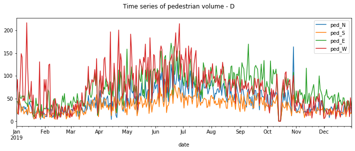

# Estimating pedestrian volume (AADPT) for each crossing given the total AADPT and site characteristics

The goal of this project is to develop a method to calculate the average annual daily pedestrian traffic (AADPT) for each crossing in a given signalized intersection with a given total AADPT.

## Dataset
The data set for this project include pedestrian/cyclist counts for signalized intersections every 15 minutes interval from around 2018 to 2022 from three regions:
- Milton, Ontario, Canada: 3,600,929 counts for 50 intersections
- Toronto, Ontario, Canada: 6,618,624 counts for 65 intersections
- Pima County Arizona, U.S.: 9,119,014 counts for 108 intersections
The following plot showes the time series plot for the aggregated daily counts for four appraoches of an intersection for 2019 for Milton. 




## Phase 1: Use one/multiple short-term counts to estimate AADPT ratio
The simplest method is to take the ratio from one or multiple available short-term count(s). To evaluate this method, the mentioned data sets are used to:
1. Find the true AADPT and true ratios for each crossing 
2. Use the valid days and hours to estimate the ratios from one or multiple short-term counts
    - The times of day to collect short-term count data includes 7am to 9am, 11am to 2pm and 3pm to 6pm occurring on Tuesdays, Wednesdays, and Thursdays from Sep to Nov.
    - Exlcuding the holidays (e.g. new year's day)
3. Evaluate the error related to this estimate

The developed code can be used on any data set with similar structure.

### How to Use
First, you need to prepare three csv files and save in 'data/' directory as follows:
- 'datasetName.csv': the timee series pedstrian counts for each crossing with column neams as (name, ped_N, ped_S, ped_E, ped_W)
- 'datasetName_holidays.csv': holiday dates in the region with (YYYY-MM-DD) format
- 'datasetName_intersections.csv': intersection names to be considered in the analysis

Then you can follow these steps to run analysis.

```shell
# 1. First, clone the repo
$ git clone https://github.com/mz-zarei/ped-vol-disagg-project.git
$ cd ped-vol-disagg-project/

# 2. Create a vitural Python environment
$ python3 -m venv .venv
$ source .venv/bin/activate

# 3. Install all requirements
$ pip install -r requirements.txt

# 4. Run!
$ python stc_estimation/main.py --dataset DatasetName
```

You can customize step four adding following features to the command:

- '--dataset': the prefix of the input and output datasets (default: 'milton')
- '--data-path': the directory where inputs are located (default: '/data/')
- '--out-path': the directory to save outputs (default: './outs')
- '--start-date': start date for the analysis period (default: '2021-10-01')
- '--end-date': end date for the analysis period (default: '2022-09-30')
- '--Max15min': Max valid value for 15min counts (default: 100)
- '--Max24h': Max valid value for 24h counts (default: 500)
- '--Min24h': Min valid value for 24h counts (default: 72)
- '--stc-num': Number of short-term counts to be used for ratio estimation (default: 1)
- '--repeat': number of samples to be taken with given stc_num for ratio estimation (default: 100)
- '--percentile': nth percentile to be reported in the output (default: 85)
- '--verbos': enables showing result in each step (default: False)


The outputs will be saved at 'stc_estimation/outs/' including two files:
- 'datasetName_error_df.csv': all ratio estimation errors for each intersection using each STC count(s) 
- 'datasetName_res_df.csv': aggregated error results in terms of 95% confidence intervals and and Nth percentile for each intersection


## To Do:
- Analysis the results for given intersections
- Use statitical methods to estimate AADPT ratio and compare it with the ones from STC estimation method