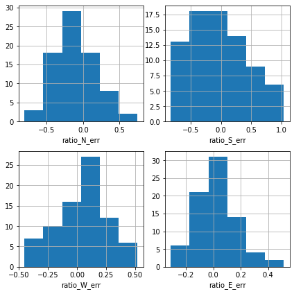

# Estimating pedestrian volume (AADPT) for each apprach given the total AADPT and site characteristics

In this project the goal is to find a method to disaggregate the average annual daily pedestrian traffic (AADPT) into each appraoch for a given signalized intersection. 

## Dataset
The data set for this project include pedestrian/cyclist counts from Milton a town in Southern Ontario, Canada. There are 24 signalized intersections with pedestrian/cyclist/vehicle counts from every 15 minutes interval from 2018-05-25 15:00:00 to 2020-04-16 23:45:00. The following plot showes the time series plot for the aggregated daily counts for four appraoches of the intersection for 2019. 

## Baseline: use short-term count ratio
The simplest method is to take the ratio from an available short-term count. To evaluate this method, the mentioned data set is used to:
1. Find the true AADPT and volume ratios for each approach
2. Use the valid days and hours to estimate the ratios from the short-term count
    - The times of day to collect short-term count data includes 7am to 9am, 11am to 2pm and 3pm to 6pm occurring on Tuesdays, Wednesdays, and Thursdays.
    - Exlcuding the holidays (e.g. new year's day)
3. Evaluate the error related to this estimate

The results showed that the volume ratio estimation error follows a normal distribution and its 95% confidence interval in almost all intersections is about -50% to +50%. 

